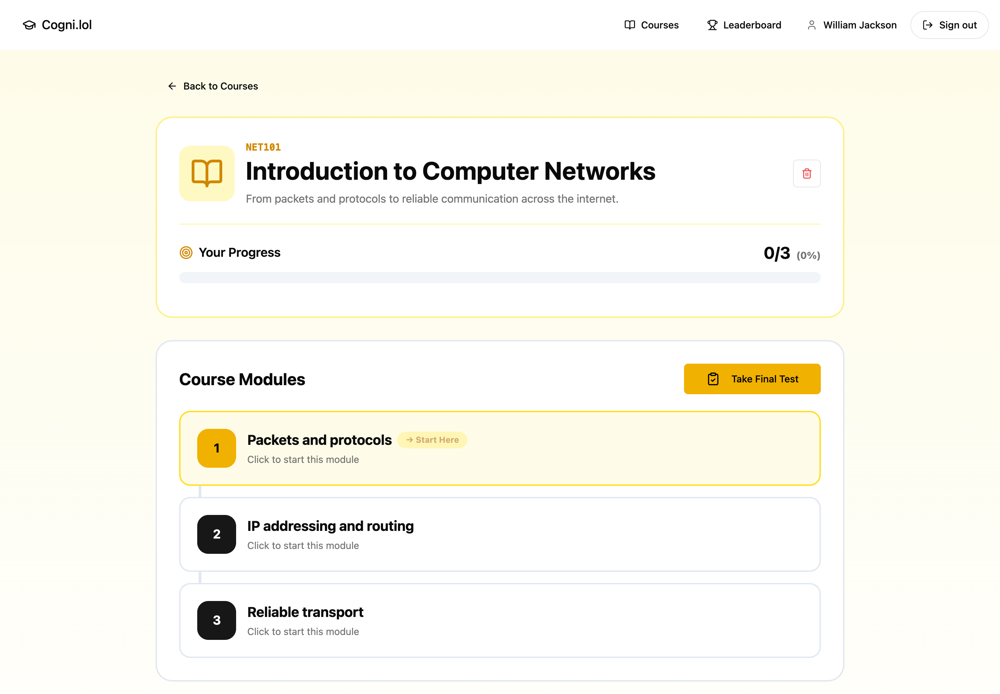
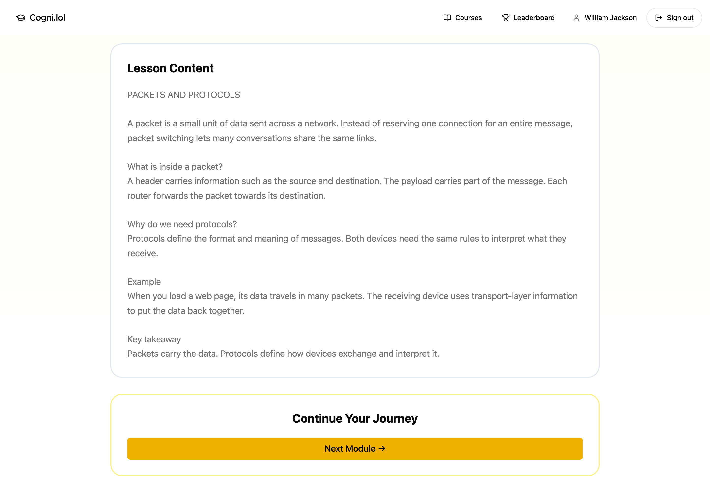
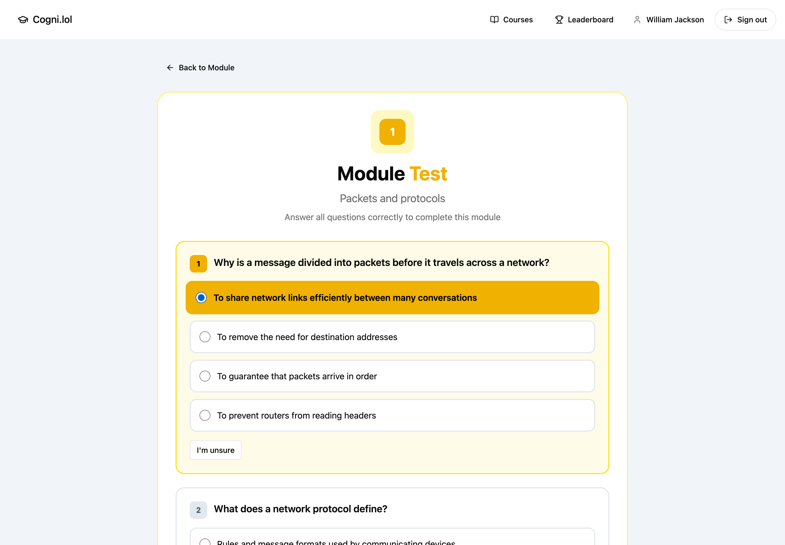

# Cogni.lol

Turn PDFs into courses with AI summaries, lessons, quizzes and a study coach.

**Second place at the 2025 Tanda Hackathon.** Built by William Jackson, William Qu and Yiming He.

[](docs/media/homepage.png)

## A course in action

Course modules → lesson notes → quizzes. Screenshots use illustrative networking content in the existing app; AI generation is not running in this demo.

[](docs/media/course.png)

| Lesson notes                                                              | Module quiz                                                                 |
| ------------------------------------------------------------------------- | --------------------------------------------------------------------------- |
| [](docs/media/lesson.png) | [](docs/media/quiz.png) |

## Run locally

Requires Docker and an Anthropic API key. Copy `.env.example` to `.env`, then fill in the database settings, `SECRET_KEY` and `ANTHROPIC_API_KEY`.

```sh
docker compose up --build
```

Open [localhost:8080](http://localhost:8080). React + TypeScript frontend, FastAPI backend and PostgreSQL.
